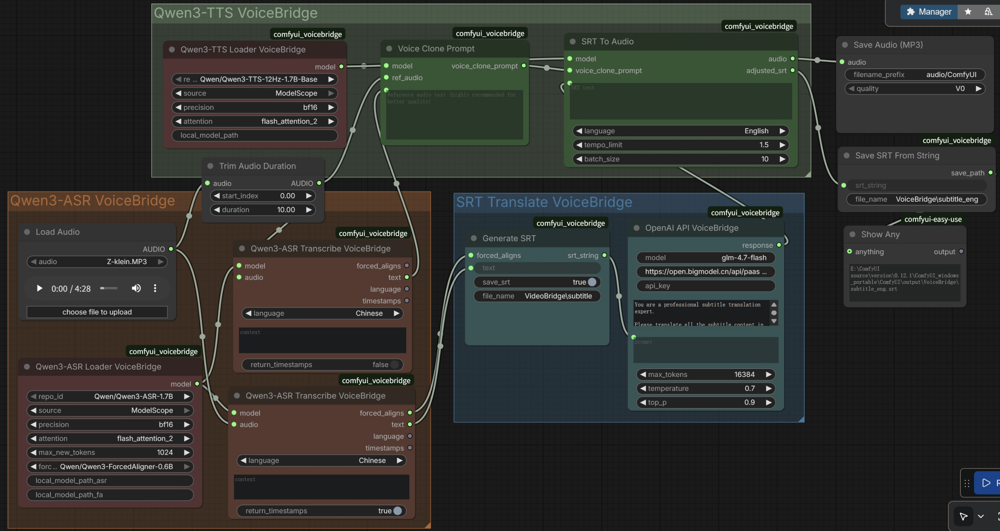

# ComfyUI-VoiceBridge

ComfyUI-VoiceBridge is a powerful ComfyUI custom node that translates spoken audio from any language to a target language while preserving the original speaker's voice characteristics, and generates bilingual SRT subtitle files. 

---
This node integrates ASR (Automatic Speech Recognition), LLM (Large Language Model), and TTS (Text-to-Speech) technologies to provide a complete speech translation pipeline.



# Features

- **Speech Translation:** Convert speech from one language to any other language while retaining the original speaker's voice timbre


- **Multi-Language Support:** Support for speech recognition and translation in dozens of languages covering major global languages

- **Automatic voice alignment:** The generated translated voice is automatically aligned with the original voice to ensure the synchronization between the translated voice and the video content.

- **Accurate subtitle generation:** Through force align technology, accurate subtitles can be generated, ensuring that the subtitles and voice are synchronized at the millisecond level.


## Installation

### Via ComfyUI Manager (Recommended)
Search for "VoiceBridge" in ComfyUI Manager

### Manual Installation
```bash
cd ComfyUI/custom_nodes
git clone https://github.com/YanTianlong-01/comfyui_voicebridge.git
cd comfyui_voicebridge
pip install -r requirements.txt
```

### Model Directory Structure
VoiceBridge automatically searches or download models in the following priority:

```text
ComfyUI/
├── models/
│   └── Qwen3-TTS/
│   |   ├── Qwen3-TTS-12Hz-1.7B-Base/
│   |   ├── Qwen3-TTS-12Hz-0.6B-Base/
│   └── Qwen3-ASR/
│       ├── Qwen3-ASR-1.7B/
│       ├── Qwen3-ASR-0.6B/
│       ├── Qwen3-ForcedAligner-0.6B/
```

or you can use the local model path. Setting `local_model_path`=`qwen-tts/Qwen3-TTS-12Hz-1.7B-Base` means use the model in `ComfyUI/models/qwen-tts/Qwen3-TTS-12Hz-1.7B-Base`.

For ASR models, you can set `local_model_path_asr`=`qwen-asr/Qwen3-ASR-1.7B`.
For ForcedAligner models, you can set `local_model_path_fa`=`qwen-asr/Qwen3-ForcedAligner-0.6B`.


## Nodes


### VoiceBridge ASR Loader

Loads the Qwen3-ASR model with auto-download support. This node manages model loading with intelligent caching and supports both HuggingFace and ModelScope model sources.

| Input | Type | Description |
|-------|------|-------------|
| repo_id | dropdown | Model repository selection (Qwen/Qwen3-ASR-1.7B or Qwen/Qwen3-ASR-0.6B) |
| source | dropdown | Model download source: HuggingFace or ModelScope |
| precision | dropdown | Computation precision: fp16, bf16, or fp32 |
| attention | dropdown | Attention implementation: auto, flash_attention_2, sdpa, or eager |
| max_new_tokens | INT | Maximum tokens to generate during transcription (default: 256, range: 1-4096) |
| forced_aligner | dropdown | Optional forced aligner model for word-level timestamps (None or Qwen/Qwen3-ForcedAligner-0.6B) |
| local_model_path_asr | STRING | Optional custom local path for ASR model loading |
| local_model_path_fa | STRING | Optional custom local path for forced aligner model loading |
| **Output** | **Type** | **Description** |
| model | QWEN3_ASR_MODEL | Loaded ASR model instance for transcription operations |

---

### VoiceBridge ASR Transcribe

Transcribes a single audio input to text using the loaded Qwen3-ASR model. Supports automatic language detection and optional timestamp generation for precise word-level timing.

| Input | Type | Description |
|-------|------|-------------|
| model | QWEN3_ASR_MODEL | Pre-loaded ASR model from VoiceBridge ASR Loader |
| audio | AUDIO | Audio input in ComfyUI format (waveform and sample_rate) |
| language | dropdown | Target language for transcription or "auto" for automatic detection |
| context | STRING | Optional context hints to improve transcription accuracy for specialized content |
| return_timestamps | BOOLEAN | Enable word-level timestamp output for precise timing information |
| **Output** | **Type** | **Description** |
| forced_aligns | LIST | List of ForcedAlignItem objects containing word-level timing data (if timestamps enabled) |
| text | STRING | Transcribed text content from the audio input |
| language | STRING | Detected or specified language code |
| timestamps | STRING | Formatted string with word-level timestamps in "start_time-end_time: word" format (if enabled) |

---

### VoiceBridge TTS Loader

Loads the Qwen3-TTS text-to-speech model with auto-download support. This node handles model caching and supports multiple model variants for different voice synthesis needs.

| Input | Type | Description |
|-------|------|-------------|
| repo_id | dropdown | Model repository selection (Qwen/Qwen3-TTS-12Hz-1.7B-Base or Qwen/Qwen3-TTS-12Hz-0.6B-Base) |
| source | dropdown | Model download source: HuggingFace or ModelScope |
| precision | dropdown | Computation precision: fp16, bf16, or fp32 |
| attention | dropdown | Attention implementation: auto, flash_attention_2, sdpa, or eager |
| local_model_path | STRING | Optional custom local path for TTS model loading |
| **Output** | **Type** | **Description** |
| model | QWEN3_TTS_MODEL | Loaded TTS model instance for voice synthesis operations |

---

### Voice Clone Prompt

Creates a voice clone prompt from reference audio for use with the Qwen3-TTS model. This enables voice cloning by extracting voice characteristics from a sample audio file.

| Input | Type | Description |
|-------|------|-------------|
| model | QWEN3_TTS_MODEL | Pre-loaded TTS model from VoiceBridge TTS Loader |
| ref_audio | AUDIO | Reference audio sample for voice cloning (ComfyUI Audio format) |
| ref_text | STRING | Transcript of the reference audio content (highly recommended for better quality) |
| **Output** | **Type** | **Description** |
| voice_clone_prompt | VOICE_CLONE_PROMPT | Voice clone prompt object containing extracted voice characteristics for TTS generation |

---

### Generate SRT

Generates an SRT subtitle file from transcribed text and forced alignment timestamps. This node combines text segmentation with timestamp data to create properly timed subtitle entries.

| Input | Type | Description |
|-------|------|-------------|
| forced_aligns | LIST | List of ForcedAlignItem objects with word-level timestamps from ASR transcription |
| text | STRING | Input text content to convert to SRT format |
| save_srt | BOOLEAN | Enable automatic saving of the generated SRT file to output directory (default: True) |
| file_name | STRING | Base file name for the SRT output (default: "VoiceBridge\subtitle") |
| **Output** | **Type** | **Description** |
| srt_string | STRING | Generated SRT formatted string with proper timestamps and segmentation |

---
### VoiceBridge AI API

Provides integration with OpenAI-compatible API endpoints for AI-powered text processing. Supports customizable system prompts and generation parameters for flexible content generation workflows.

| Input | Type | Description |
|-------|------|-------------|
| model | STRING | API model identifier to use for text generation |
| base_url | STRING | Base URL endpoint for the API (must be OpenAI-compatible) |
| api_key | STRING | API authentication key for the service |
| system_prompt | STRING | System instruction defining the AI assistant's behavior and constraints |
| prompt | STRING | User prompt or query to send to the API |
| max_tokens | INT | Maximum number of tokens in the generated response (default: 4096, range: 1-1000000) |
| temperature | FLOAT | Sampling temperature controlling randomness (default: 0.7, range: 0-1) |
| top_p | FLOAT | Nucleus sampling threshold for token selection (default: 0.95, range: 0-1) |
| **Output** | **Type** | **Description** |
| response | STRING | Generated text response from the API |

---

### SRT To Audio

Converts SRT subtitle content to audio using the Qwen3-TTS model with voice cloning. Includes intelligent duration matching to align generated audio with subtitle timing, with optional speed adjustment for timing mismatches.

| Input | Type | Description |
|-------|------|-------------|
| model | QWEN3_TTS_MODEL | Pre-loaded TTS model from VoiceBridge TTS Loader |
| srt_string | STRING | SRT formatted subtitle text to convert to audio |
| voice_clone_prompt | VOICE_CLONE_PROMPT | Voice clone prompt from Voice Clone Prompt node |
| language | dropdown | Target language for synthesis or "auto" for automatic detection |
| tempo_limit | FLOAT | Maximum speed-up factor for audio that exceeds subtitle duration (default: 1.5, range: 1.0-5.0) |
| mini_gap_ms | INT | Minimum gap between consecutive subtitles in milliseconds (default: 100, range: 0-10,000) |
| batch_size | INT | Number of subtitle entries to process in each batch (default: 10, range: 1-1,000) |
| **Output** | **Type** | **Description** |
| audio | AUDIO | Generated audio in ComfyUI format (waveform and sample_rate) |
| adjusted_srt | STRING | Adjusted SRT string with corrected timing based on actual audio durations |


---

### Save SRT From String

Saves an SRT formatted string to a file in the ComfyUI output directory. Automatically handles file naming conflicts by appending incrementing indices.

| Input | Type | Description |
|-------|------|-------------|
| srt_string | STRING | SRT formatted string content to save |
| file_name | STRING | Base file name for the SRT output (default: "VoiceBridge\subtitle") |
| **Output** | **Type** | **Description** |
| save_path | STRING | Full path where the SRT file was saved |


## Acknowledgments

- [Qwen3-TTS](https://github.com/QwenLM/Qwen3-TTS): Official open-source repository by Alibaba Qwen team.
- [ComfyUI-Qwen3-ASR](https://github.com/DarioFT/ComfyUI-Qwen3-ASR): A nice and clean ComfyUI node by DarioFT.

## License

This project is licensed under the MIT License - see the [LICENSE](./LICENSE) file for details.

